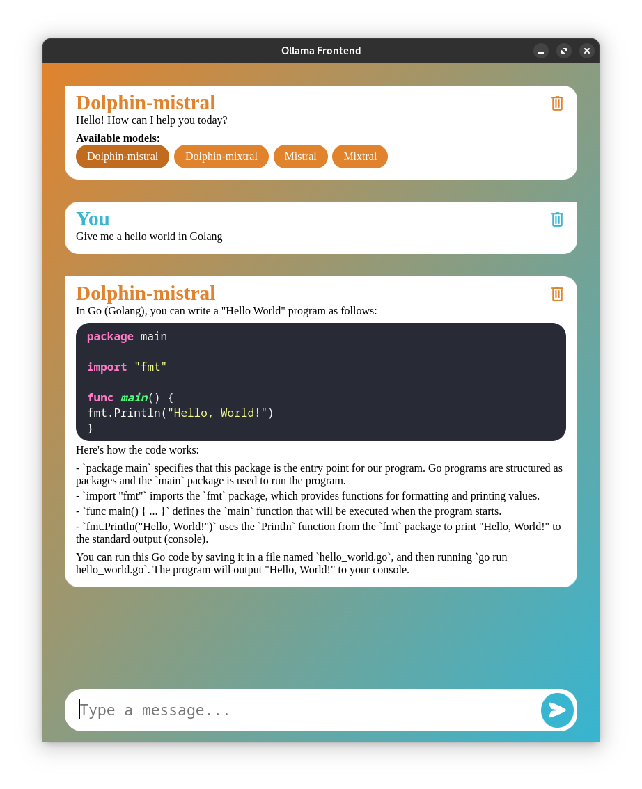

# Ollama front



This is a frontend project in electron to use your local LLM models in a GUI via ollama.

## Installation

```bash
npm install
```

## Usage

```bash
npm start
```

## License
This code is under the [MIT](https://choosealicense.com/licenses/mit/) license.
Basically, as is. Use it as you wish. I am not responsible for anything.

I do not own the rights to `highlightjs` and the [trash icon](https://icons8.com/icon/4B0kCMNiLlmW/trash) used in the
project. They are under their respective licenses.
